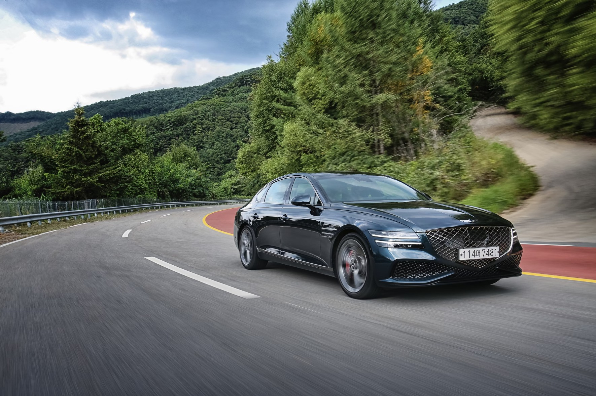
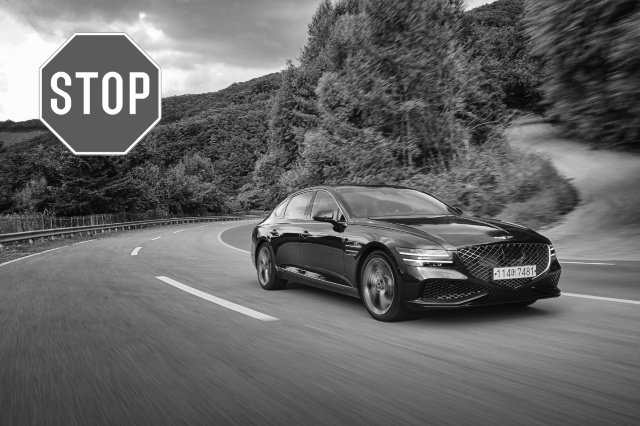
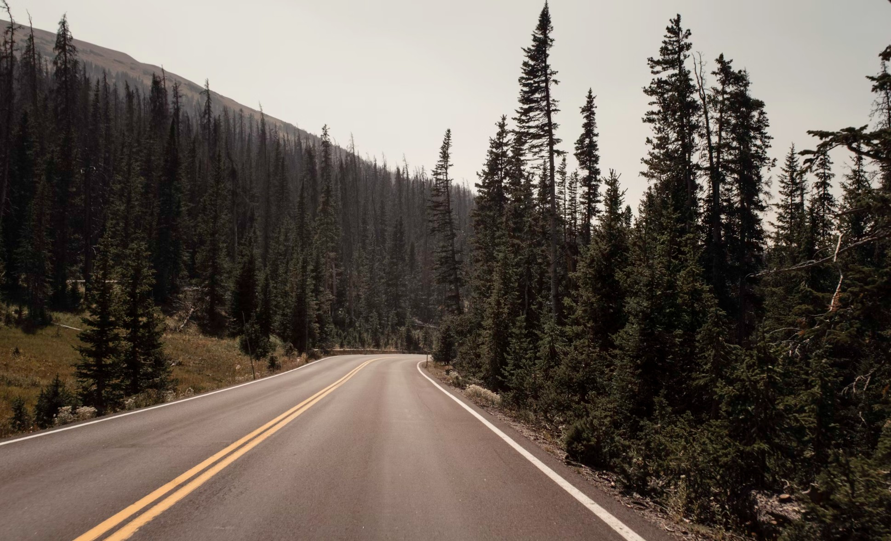
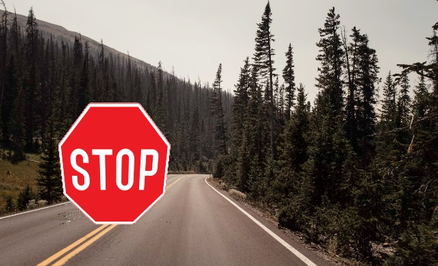
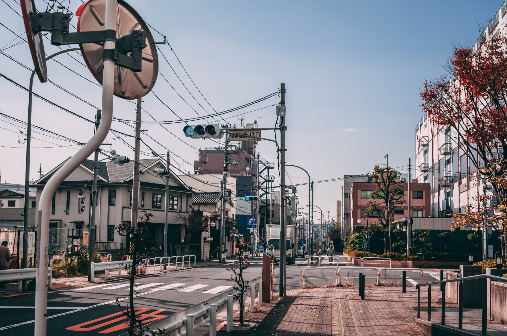
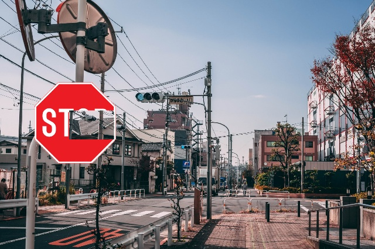
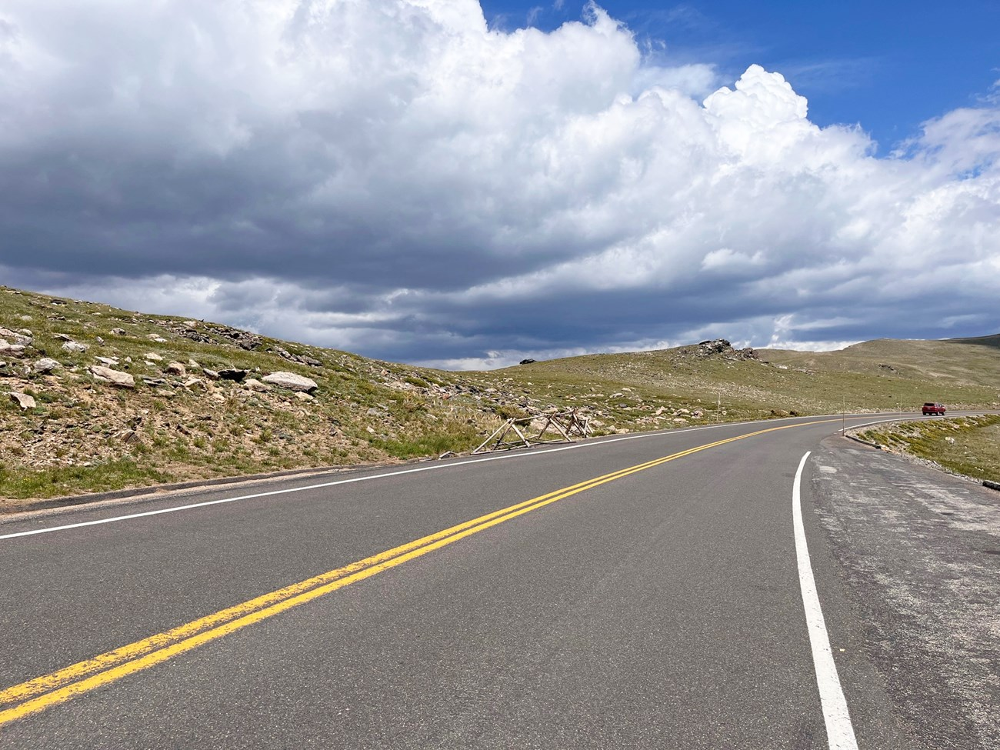
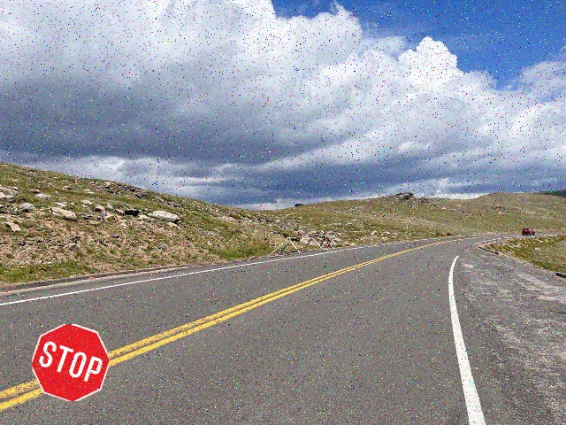
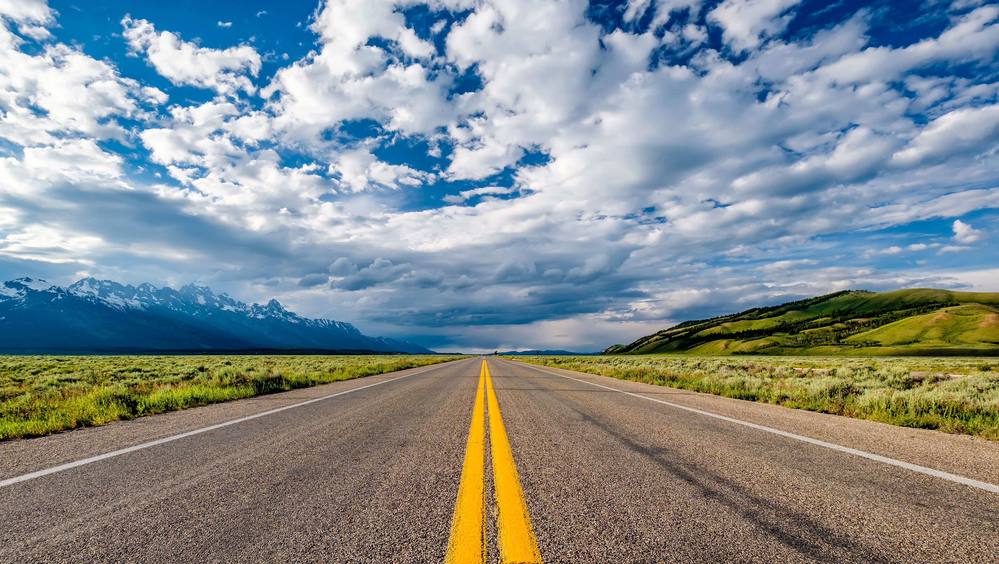
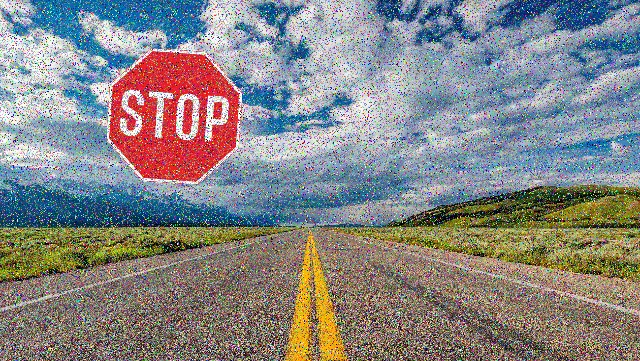

# YOLO-augmenter
Image Augmentation for Object Detection in YOLO Format

This repository contains code and resources for augmenting various types of signs and objects onto background images, formatted for YOLO object detection training. The goal is to generate synthetic training data by overlaying objects (e.g., signs, logos, or any other custom images) onto different backgrounds. This process is useful for training deep learning models for object detection tasks in various domains such as autonomous driving, surveillance, or retail analytics.

## Features
- **Overlay Custom Objects**: Augments various custom images (e.g., signs, logos) onto different background images with automatic calculation and annotation of bounding boxes in YOLO format.
- **Perspective Transformation**: Applies random perspective transformations to objects for realistic augmentation by warping the image using a four-point transformation method.
- **Noise and Blur Effects**: Adds visual noise such as salt-and-pepper noise and Gaussian blur to simulate different environmental conditions and camera effects.
- **Grayscale and Color Variations**: Converts objects to grayscale or other color variations for diverse testing and visual variations.
- **Random Rotation**: Rotates objects at random angles to introduce diversity in orientation, enhancing the robustness of training data.
- **Resizing and Scaling**: Dynamically resizes objects proportionally before overlaying them on backgrounds, ensuring appropriate scaling based on the background size.
- **Random Occlusion**: Adds occlusions over parts of the object to simulate real-world scenarios where objects may be partially obstructed.

## Usage
To use this code, you will need:
1. **Background Image**: A suitable background image where the objects will be overlaid.
2. **Object Image**: The image of the object (e.g., sign or logo) you want to overlay on the background.
3. **Object Black and White Image**: A version of the object image where the background is black, and the object itself is white. This is similar to the Stop sign image available in the repository.

The black and white object image is used to ensure consistent object detection and augmentation by distinguishing the object from the background. Make sure the black and white version of the object matches the shape and position of the original object image.

## Output

| Background | Output Image | YOLO Output(C,X,Y,W,H) |
| -------- | -------- | -------- |
|  |  | 0, 0.15641, 0.21968, 0.19198, 0.28923 |
|  |  | 0, 0.26058, 0.61408, 0.25645, 0.45547 |
|  |  | 0, 0.20056, 0.49363, 0.21695, 0.32625 | 
|  |  | 0, 0.12462, 0.85333, 0.13538, 0.18051 |
|  |  | 0, 0.27254, 0.32294, 0.21088, 0.37339 |

